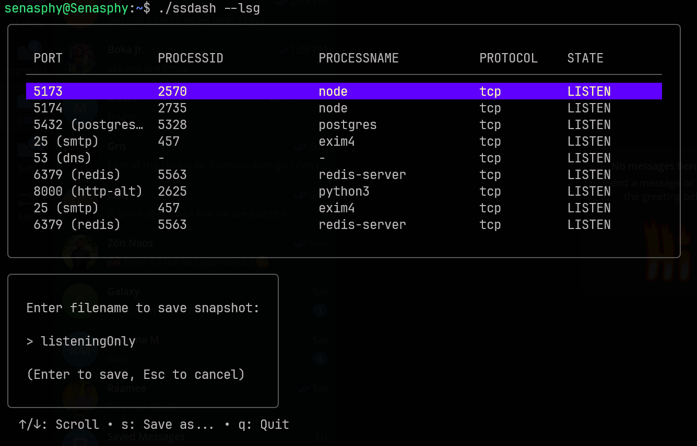

# SSDash

SSDash is a real time terminal dashboard for monitoring network connections. Built with Go and the Bubble Tea TUI framework, it provides a reactive interface for inspecting active ports, PIDs, and process names.

## Project Overview

The following images demonstrate the interface in various states of operation.


The main view of SSDash when running the binary without additional arguments. It displays a comprehensive list of all active connections including UDP and TCP protocols across various states.


The interface when running with the listening flag. This view also shows the interactive filename prompt that appears when initiating a snapshot save.

## Key Features

* Real Time Updates: Uses an asynchronous tick system to refresh connection data every 2 seconds without freezing the UI.
* Asynchronous IO: System scans and file saving operations run in background goroutines to maintain UI responsiveness.
* Dynamic Snapshots: Export current connection states to structured JSON files with a built in interactive filename prompt.
* Modular Architecture: Clean separation between UI logic, system scanning, and data persistence.
* Process Resolution: Maps local ports to their respective Process IDs and Process Names.

## Project Architecture

The project follows a modular structure to separate concerns:

* internal/app: Contains the Bubble Tea Model, Update, and View logic.
* internal/connections: Handles OS specific commands and raw data parsing.
* internal/snapshot: Manages JSON encoding and disk persistence.

## Getting Started

### Prerequisites
* OS: Linux (uses the ss utility).
* Privileges: sudo is required to resolve Process Names and PIDs.

### Installation
1. Clone the repository: `git clone https://github.com/yourusername/ssdash.git`
2. Enter the directory: `cd ssdash`
3. Install dependencies: `go mod tidy`
4. Build and Run: `go run main.go`

### Available Flags
You can use the following flags to filter the connection list on startup:

* -tcp: List TCP connections only.
* -udp: Show UDP connections only.
* -estab: Show established connections only.
* -lsg: Show listening connections only.
* -find [name]: List all connections matching a specific process or service name.

## Controls

| Key | Action |
| :--- | :--- |
| Up / Down Arrows | Scroll through the connection table |
| s | Save Snapshot: Opens prompt to enter a filename |
| Enter | Confirm filename and save JSON |
| Esc | Cancel naming mode or Quit |
| q | Quit application |

## Data Export Format

SSDash allows you to save your filtered or unfiltered lists to a prettified JSON file. This is useful for security audits or external logging.

```json
{
  "timestamp": "2026-01-05T22:09:40Z",
  "entries": [
    {
      "port": "5432 (postgres)",
      "process-id": "5328",
      "process-name": "postgres",
      "protocol": "tcp",
      "state": "LISTEN"
    }
  ]
}
