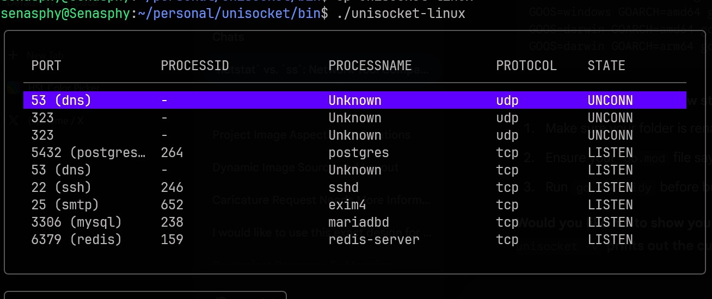

# UniSocket

UniSocket is a real-time terminal dashboard for monitoring network connections. Built with Go and the Bubble Tea TUI framework, it provides a reactive interface for inspecting active ports, PIDs, and process names across multiple operating systems.

## Project Overview

The following images demonstrate the interface in various states of operation.


This is a display of the program running a linux machine. It is being executed with no filters and, meaning every connection is listed. It is also possible to see the name resolution in action in the image.

The image shows the program being executed on a windows machine. In this specific usecase, the program is running with the --udp filter which obviously displays the UDP connections.
## Key Features

* Real Time Updates
* Asynchronous IO 
* Dynamic Snapshots 
* Cross Platform Support
* Process Resolution 

## Project Architecture

The project uses a modular structure with conditional compilation to handle OS differences:

* cmd/unisocket: The application entry point.
* internal/app: Contains the Bubble Tea Model, Update, and View logic.
* internal/connections: The core engine. It uses OS-specific files (engine_linux.go, engine_windows.go, engine_darwin.go) to interface with system utilities like ss, netstat, and lsof.
* internal/snapshot: Manages JSON encoding and disk persistence.

## Getting Started

### Prerequisites
* Linux: requires the ss utility.
* macOS: uses lsof.
* Windows: uses netstat.
* Privileges: sudo or Administrator permissions are required to resolve Process Names and PIDs.

### Installation
1. Clone the repository: `git clone https://github.com/Senasphy/unisocket.git`
2. Enter the directory: `cd unisocket`
3. Install dependencies: `go mod tidy`
4. Build and Run: `go run ./cmd/unisocket`

### Multi Platform Build
To build for a specific platform from any OS:

* Linux: `GOOS=linux GOARCH=amd64 go build -o bin/unisocket-linux ./cmd/unisocket`
* Windows: `GOOS=windows GOARCH=amd64 go build -o bin/unisocket.exe ./cmd/unisocket`
* macOS (Intel): `GOOS=darwin GOARCH=amd64 go build -o bin/unisocket-mac-intel ./cmd/unisocket`
* macOS (M-Series): `GOOS=darwin GOARCH=arm64 go build -o bin/unisocket-mac-arm ./cmd/unisocket`

## Available Flags
Use these flags to filter the connection list on startup:

* -tcp: List TCP connections only.
* -udp: Show UDP connections only.
* -estab: Show established connections only.
* -lsg: Show listening connections only.
* -find [name]: List all connections matching a specific process or service name.


## Data Export Format

Snapshots are saved as prettified JSON files.

```json
{
  "timestamp": "2026-02-09T22:09:40Z",
  "entries": [
    {
      "port": "5432 (postgres)",
      "process-id": "5328",
      "process-name": "postgres",
      "protocol": "tcp",
      "state": "LISTEN"
    }
  ]
}
