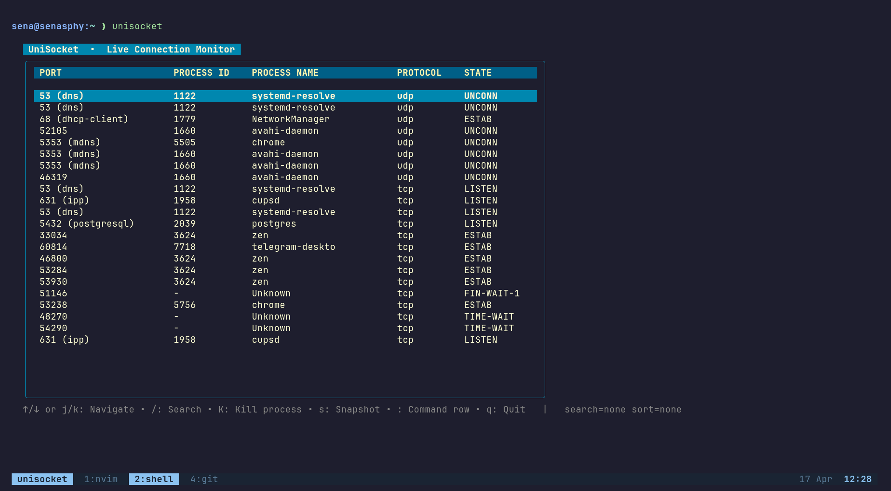
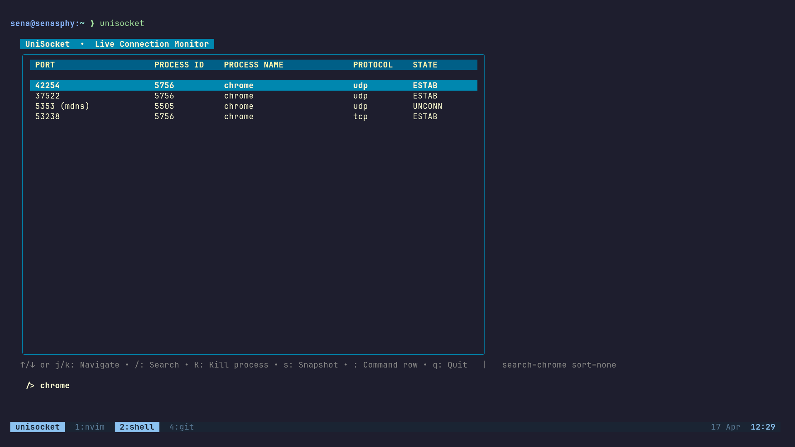

# UniSocket

UniSocket is a cross-platform terminal dashboard for live network connection monitoring.  
It is built with Go + Bubble Tea, and designed with a polished retro terminal look while staying keyboard-first.

## Screenshots




## Features

- Live refresh of active connections.
- Process-aware rows: port, PID, process name, protocol, and state.
- Cross-platform engines (Linux, macOS, Windows).
- Keyboard-first workflow with search, sorting, snapshot export, and process termination.
- Retro visual style with strong selected-row focus for fast scanning.

## Installation

### 1. Install From GitHub Releases (Recommended)

1. Open the latest release page: `https://github.com/Senasphy/unisocket/releases/latest`
2. Download the archive for your OS/architecture.
3. Extract it and move the binary to a directory in your `PATH`.

Linux/macOS example:

```bash
chmod +x unisocket
sudo mv unisocket /usr/local/bin/unisocket
```


### 2. Install With Go

```bash
go install github.com/Senasphy/unisocket/cmd/unisocket@latest
```

### 3. Build From Source

```bash
git clone https://github.com/Senasphy/unisocket.git
cd unisocket
go mod tidy
go build -o unisocket ./cmd/unisocket
```

## Usage

```bash
unisocket
```

### Startup Flags

- `-tcp`: Show TCP only.
- `-udp`: Show UDP only.
- `-estab`: Show established connections only.
- `-lsg`: Show listening connections only.
- `-find <name>`: Filter by process/service name at startup.

## Navigation & Controls

- `↑/↓` or `j/k`: Move selection.
- `/`: Open search row (live filtering while typing).
- `:`: Open command row (Neovim-style).
- `s`: Save current table to JSON snapshot.
- `K`: Open process termination confirmation popup.
- `q`, `esc`, `ctrl+c`: Quit.

### Command Row

- `:sn` sort by connection/service name (PORT column).
- `:spn` sort by process name.
- `:spid` sort by PID.

## Process Termination

Press `K` on a selected row to open a confirmation popup.

- `Enter`: Confirm termination.
- Any other key: Cancel.

## Snapshots

Snapshots are exported as formatted JSON and include:

- timestamp
- port
- process-id
- process-name
- protocol
- state


## Contributing

Contributions are welcome from anyone.

- Open an issue for bugs or feature requests.
- Open a pull request with clear scope and rationale.
- Keep changes focused and tested (`go test ./...`).

## License

Licensed under the MIT License. See [LICENSE](./LICENSE).
